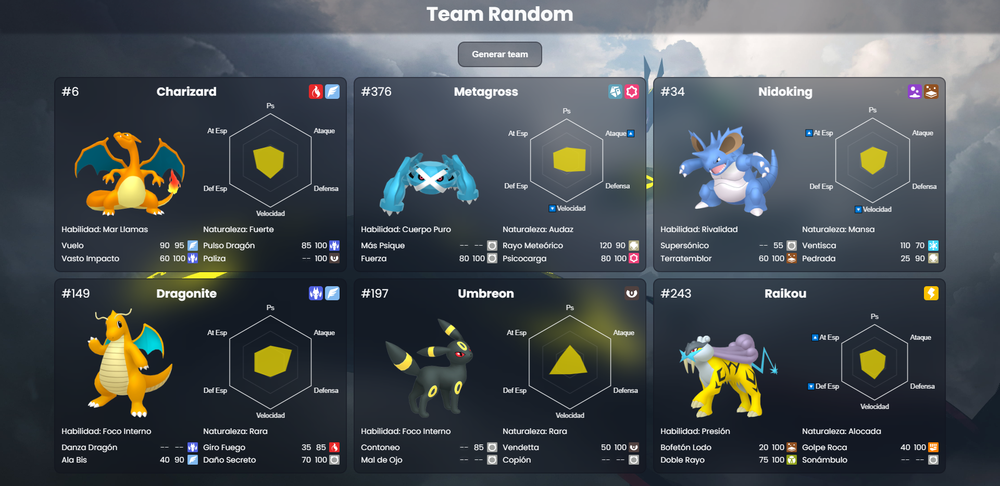

# Team Randomizer - Generador de Equipos Pokémon Aleatorios

Este proyecto personal ha sido desarrollado como una práctica para mejorar mis habilidades en HTML, CSS y JS. El objetivo principal es generar un equipo de 6 Pokémon de forma aleatoria. A continuación, se detallan las características del generador:

# Características del Generador

Generación de Pokémon: El generador solo considera Pokémon de la primera, segunda y tercera generación.
Factor Shiny: Existe una probabilidad para que el Pokémon generado sea "shiny".
Naturaleza Aleatoria: Cada Pokémon del equipo tendrá una naturaleza aleatoria.
Habilidad Aleatoria: Se asignará una habilidad aleatoria a cada Pokémon, en base a las habilidades que el Pókemon puede aprender.
Ataques Aleatorios: Se asignará ataques aleatoria a cada Pokémon, en base a los ataques que el Pókemon puede aprender.

# Cómo usar el Generador

Haga clic en el botón "Generar team".
Sitio del generador: https://toqui-team-random-v2.netlify.app/

# Nota sobre Derechos de Autor

Es importante tener en cuenta que este proyecto es solo con fines educativos y no tiene la intención de infringir ningún derecho de autor de Nintendo, Game Freak o The Pokémon Company. Todos los derechos de los personajes y elementos de Pokémon pertenecen a sus respectivos propietarios.

¡Gracias por revisar este proyecto! Espero que disfrutes generando equipos Pokémon aleatorios con él.
